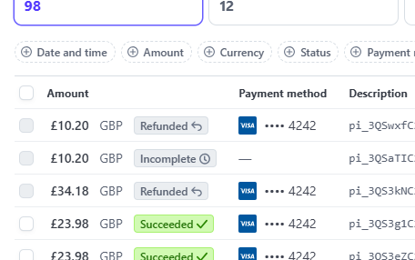

# Testing Documentation

## FAQ Fixture Data Loading Issue

### Problem
When attempting to load the FAQ fixture data, the following error occurred:
```bash
django.db.utils.IntegrityError: NOT NULL constraint failed: faq_faqcategory.created_at
```

### Solution
The issue was caused by the `created_at` field in the `FAQCategory` model not being set to a default value. To fix this, the `created_at` field was set to a default value of `now()` in the fixture data. 

The fixture data was updated and loaded successfully.

## ImageField Dependency Issue

### Problem
When running the development server, the following error occurred:
```bash
django.core.management.base.SystemCheckError: SystemCheckError: System check identified some issues:

ERRORS:
services.Service.image: (fields.E210) Cannot use ImageField because Pillow is not installed.
        HINT: Get Pillow at https://pypi.org/project/Pillow/ or run command "python -m pip install Pillow".
```

### Cause
The `Service` model uses Django's `ImageField`, which requires the Pillow library for image processing. This dependency was not installed in the virtual environment.

### Solution
Installed the Pillow library using pip:
```bash
python -m pip install Pillow
```

After installing Pillow, the development server ran successfully.

## Accounts App Implementation

### 1. Django Allauth Installation
**Issue:** ModuleNotFoundError: No module named 'accounts.apps'
**Solution:** 
- Created apps.py in accounts directory
- Added proper app configuration
- Created signals.py for user profile creation
```python
# accounts/apps.py
class AccountsConfig(AppConfig):
    default_auto_field = 'django.db.models.BigAutoField'
    name = 'accounts'

    def ready(self):
        import accounts.signals
```

### 2. Email Configuration
**Issue:** SMTPSenderRefused error when trying to send verification emails
**Solution:**
- Updated email settings in settings.py
- Created app-specific password in Gmail
- Updated environment variables
```python
# settings.py
EMAIL_BACKEND = 'django.core.mail.backends.smtp.EmailBackend'
EMAIL_HOST = 'smtp.gmail.com'
EMAIL_PORT = 587
EMAIL_USE_TLS = True
EMAIL_HOST_USER = os.getenv('EMAIL_HOST_USER')
EMAIL_HOST_PASSWORD = os.getenv('EMAIL_HOST_PASSWORD')
```

### 3. Template Rendering
**Issue:** Invalid filter: 'crispy'
**Solution:**
- Installed django-crispy-forms and crispy-bootstrap5
- Added to INSTALLED_APPS
- Added crispy forms configuration
```python
# settings.py
INSTALLED_APPS = [
    ...
    'crispy_forms',
    'crispy_bootstrap5',
]

CRISPY_ALLOWED_TEMPLATE_PACKS = 'bootstrap5'
CRISPY_TEMPLATE_PACK = 'bootstrap5'
```

### 4. User Profile Creation
**Issue:** Profile not automatically created for new users
**Solution:**
- Moved signal from models.py to dedicated signals.py
- Ensured signal registration in apps.py
```python
# accounts/signals.py
@receiver(post_save, sender=User)
def create_or_update_user_profile(sender, instance, created, **kwargs):
    if created:
        UserProfile.objects.create(user=instance)
    instance.userprofile.save()
```

### 5. Authentication Flow
**Issue:** Incorrect redirect after login/logout
**Solution:**
- Added proper redirect settings in settings.py
```python
LOGIN_URL = '/accounts/login/'
LOGIN_REDIRECT_URL = '/'
LOGOUT_REDIRECT_URL = '/'
```

### 6. Form Styling
**Issue:** Inconsistent form styling across templates
**Solution:**
- Created consistent CSS classes
- Added to auth templates
```css
.auth-card {
    border: none;
    box-shadow: 0 2px 10px rgba(0,0,0,0.1);
    border-radius: 10px;
}

.auth-card .card-header {
    background-color: var(--primary-color);
    color: white;
}
```

### 7. Dependencies
**Issue:** Missing required packages
**Solution:**
- Updated requirements.txt with all necessary packages
```plaintext
django-allauth==65.2.0
django-crispy-forms==2.1
crispy-bootstrap5==2024.2
```

### 8. Environment Variables
**Issue:** Email configuration not working in production
**Solution:**
- Updated .env file with correct variables
- Ensured proper loading in settings.py
```plaintext
EMAIL_HOST_USER=cleanservicesplatform@gmail.com
EMAIL_HOST_PASSWORD=my-app-password
```


## Issues and Solutions (Cart & Checkout Implementation)

### 1. Site Configuration Error
**Issue:** Site matching query does not exist error when accessing login page
**Solution:** 
- Created management command to ensure site exists
```python
# accounts/management/commands/create_default_site.py
class Command(BaseCommand):
    def handle(self, *args, **kwargs):
        if Site.objects.exists():
            Site.objects.all().delete()
        Site.objects.create(
            id=1,
            domain='127.0.0.1:8000',
            name='Clean Services Platform'
        )
```

### 2. Profile Data Not Loading in Checkout
**Issue:** User profile data not pre-filling checkout form
**Solution:**
- Added UserProfile import to checkout views
- Updated checkout view to pull profile data
```python
# checkout/views.py
from accounts.models import UserProfile  # Changed from profiles to accounts

if request.user.is_authenticated:
    try:
        profile = UserProfile.objects.get(user=request.user)
        order_form = OrderForm(initial={
            'full_name': profile.user.get_full_name(),
            'email': profile.user.email,
            'phone_number': profile.default_phone_number,
            # ... other fields
        })
```

### 3. Admin Interface Profile Visibility
**Issue:** Admin couldn't see user profile details
**Solution:**
- Added inline admin configuration for UserProfile
```python
# accounts/admin.py
class UserProfileInline(admin.StackedInline):
    model = UserProfile
    can_delete = False
    verbose_name_plural = 'Profile'

class UserAdmin(BaseUserAdmin):
    inlines = (UserProfileInline,)
    list_display = ('email', 'first_name', 'last_name', 'is_staff', 'last_login')
```

### 4. Order-Profile Relationship
**Issue:** Orders not linked to user profiles
**Solution:**
- Added UserProfile relationship to Order model
```python
# checkout/models.py
class Order(models.Model):
    user_profile = models.ForeignKey(
        UserProfile,
        on_delete=models.SET_NULL,
        null=True,
        blank=True,
        related_name='orders'
    )
```

### 5. Module Import Error
**Issue:** ModuleNotFoundError: No module named 'profiles'
**Solution:**
- Fixed import statement in checkout views
- Changed from `profiles.models` to `accounts.models`
- Updated related imports across the project

### 6. Migration Conflicts
**Issue:** Conflicting migrations in accounts app
**Solution:**
- Removed conflicting migration files
- Created new migration for site creation
- Applied migrations in correct order:
```bash
python manage.py migrate sites
python manage.py migrate accounts
python manage.py migrate
```

### 7. Cart Price Formatting
**Issue:** Tax and Total amounts in cart showing too many decimal places
**Solution:**
- Updated Cart class to use Decimal quantize with ROUND_HALF_UP
- Added template filters for display formatting
```python
# cart/cart.py
from decimal import Decimal, ROUND_HALF_UP

def get_tax(self):
    """Calculate tax amount."""
    tax = self.get_subtotal_price() * Decimal(settings.TAX_RATE)
    return tax.quantize(Decimal('.01'), rounding=ROUND_HALF_UP)
```

```html
<!-- cart/templates/cart/detail.html -->
<td colspan="2">
    <strong>£{{ cart.get_tax|floatformat:2 }}</strong>
</td>
```

The changes:
- Added ROUND_HALF_UP 
- Used quantize to ensure 2 decimal places in calculations
- Added floatformat:2 filter in templates
- Applied to subtotal, tax, and total amounts

### 8. Profile Update on Checkout
**Issue:** Profile address not updating when selecting "Update profile" in checkout
**Solution:**
- Fixed session handling of save_info flag
- Updated checkout success view to properly handle profile updates
```python
# checkout/views.py
def checkout_success(request, order_number):
    save_info = request.session.get('save_info')
    if request.user.is_authenticated and save_info:
        profile = UserProfile.objects.get(user=request.user)
        profile.default_phone_number = order.phone_number
        profile.default_street_address1 = order.street_address1
        # ... other fields ...
        profile.save()
```

### 9. Checkout Form Save Info Checkbox
**Issue:** Confusing "False" label on save info checkbox
**Solution:**
- Updated checkbox label and styling
- Added help text for clarity
```html
<!-- checkout/templates/checkout/checkout.html -->
<div class="form-check">
    <input class="form-check-input" type="checkbox" name="save_info" 
           id="id_save_info" checked>
    <label class="form-check-label" for="id_save_info">
        Update my profile with this delivery information
    </label>
    <small class="form-text text-muted">
        Check this box to update your saved delivery information
    </small>
</div>
```

### 10. Session Cleanup
**Issue:** Save info preference persisting in session
**Solution:**
- Added session cleanup after successful checkout
```python
# checkout/views.py
def checkout_success(request, order_number):
    # ... process order ...
    if 'save_info' in request.session:
        del request.session['save_info']
```

### 11. Stripe Postal Code Field
**Issue:** US ZIP code format conflicting with UK postcodes
**Solution:**
- Disabled Stripe's postal code field
- Used our own postcode field instead
```javascript
// checkout/static/checkout/js/stripe_elements.js
var card = elements.create('card', {
    style: style,
    hidePostalCode: true,
    zipCode: false
});

stripe.confirmCardPayment(clientSecret, {
    payment_method: {
        card: card,
        billing_details: {
            address: {
                postal_code: null
            }
        }
    }
});
```

### 12. Staff Access to Booking Details
**Issue:** Staff members received 404 errors when trying to view customer bookings
**Solution:**
- Modified booking_detail view to allow staff access to all bookings
```python
@login_required
def booking_detail(request, booking_id):
    if request.user.is_staff:
        # Staff can view any booking
        booking = get_object_or_404(Booking, id=booking_id)
    else:
        # Regular users can only view their own bookings
        booking = get_object_or_404(Booking, id=booking_id, user=request.user)
```

### 13. Email Notifications
**Issue:** Booking notification emails not sending, showing error message
**Solution:**
- Removed plain text email templates
- Updated email utility functions to only send HTML emails
- Added better error handling and debugging
```python
def send_booking_pending_email(booking):
    subject = f'Booking Received - {booking.service.name}'
    from_email = settings.DEFAULT_FROM_EMAIL
    to_email = [booking.user.email]
    
    context = {
        'booking': booking,
        'user': booking.user,
    }
    
    html_content = render_to_string(
        'bookings/emails/booking_pending.html', context)
    
    send_mail(
        subject,
        '',  # Empty string for text content
        from_email,
        to_email,
        html_message=html_content,
        fail_silently=False,
    )
```

### 14. Staff Booking Management
**Issue:** Staff needed interface to manage booking requests
**Solution:**
- Added staff menu in navigation
- Created staff booking management interface
- Added context processor for pending bookings count
```python
def pending_bookings(request):
    """Add pending bookings count to context for staff members"""
    if request.user.is_staff:
        pending_count = Booking.objects.filter(status='pending').count()
        return {'pending_bookings_count': pending_count}
    return {}
```

### 15. Booking Status Workflow
**Issue:** Needed clear workflow for booking statuses
**Solution:**
- Implemented status transitions: pending → confirmed/cancelled
- Added color coding for different statuses
- Created separate email templates for each status
```python
def get_status_color(status):
    colors = {
        'pending': '#ffc107',    # Warning yellow
        'confirmed': '#28a745',  # Success green
        'cancelled': '#dc3545',  # Danger red
        'completed': '#6c757d',  # Secondary gray
    }
    return colors.get(status, '#007bff')
```

### 16. Calendar Event Navigation
**Issue:** Clicking on calendar events did not navigate to booking details
**Solution:**
- Added event click handler in calendar.js
- Improved event tooltips with more details
```javascript
eventClick: function(info) {
    var bookingId = info.event.id;
    if (bookingId) {
        window.location.href = `/bookings/detail/${bookingId}/`;
    }
}
```

### 17. Staff Booking Interface
**Issue:** Staff view had confusing/duplicate booking action buttons
**Solution:**
- Removed redundant 'Cancel Booking' button from staff view
- Added clear 'Approve' and 'Reject' buttons
- Updated navigation to return to correct management page
```html

    <form method="POST" action="" class="d-inline">
        <button type="submit" class="btn btn-success me-2">
            <i class="fas fa-check"></i> Approve Booking
        </button>
    </form>
    <form method="POST" action="" class="d-inline">
        <button type="submit" class="btn btn-danger">
            <i class="fas fa-times"></i> Reject Booking
        </button>
    </form>

```

### 18. Calendar Event Display
**Issue:** Calendar events lacked clear visual status indicators
**Solution:**
- Added status-specific colors and styling
- Included customer name for staff view
- Improved tooltip information
```python
title_parts = [booking.service.name]
if request.user.is_staff:
    title_parts.append(f"({booking.user.get_full_name()})")
title_parts.append(f"[{booking.status.upper()}]")

events.append({
    'title': " ".join(title_parts),
    'backgroundColor': get_status_color(booking.status),
    'className': f'status-{booking.status}',
})
```

### 19. Order Cancellation Workflow
**Issue:** Order cancellation process needed improvement
**Solution:**
- Added cancellation request status
- Implemented staff approval process
- Created email notifications
```python
STATUS_CHOICES = [
    ('pending', 'Pending'),
    ('processing', 'Processing'),
    ('cancellation_requested', 'Cancellation Requested'),
    ('completed', 'Completed'),
    ('cancelled', 'Cancelled'),
]
```

### 20. Checkout Price Display
**Issue:** Tax and total calculations needed clearer display
**Solution:**
- Added clear price breakdown
- Implemented warning about card charge
- Added VAT information
```html
<div class="mt-3">
    <p class="small text-danger my-0">
        <span class="icon">
            <i class="fas fa-exclamation-circle"></i>
        </span>
        <span>Your card will be charged <strong>£{{ cart.get_total }}</strong></span>
    </p>
    <p class="small text-muted mt-1">
        This includes VAT at 20% (£{{ cart.get_tax }})
    </p>
</div>
```

### 21. Decimal Precision
**Issue:** Tax and total calculations showed too many decimal places
**Solution:**
- Added decimal quantization
- Implemented custom template filter
```python
@register.filter
def multiply(value, arg):
    try:
        result = Decimal(str(value)) * Decimal(str(arg))
        return result.quantize(Decimal('0.01'))
    except (ValueError, TypeError, decimal.InvalidOperation):
        return 0
```

### 22. Payment Refund Testing
**Issue:** Needed to verify Stripe refund functionality
**Solution:**
- Implemented refund processing through Stripe API
- Tested with real transactions
- Verified refund status updates
- ```
- Test Results:
+ 
+ 
  
  The test results show:
  - Successful refund processing
  - Correct status updates
  - Proper handling of different payment states
  - Integration with Stripe working as expected
  - Multiple transaction types handled correctly

## User Story Testing Procedures

### Customer Features Testing

#### Authentication & Profile Testing
1. Account Registration
   - Navigate to registration page
   - Enter valid email and password
   - Verify email verification link received
   - Confirm account via email link
   - Expected: Account created and verified

2. Profile Management
   - Log into account
   - Update profile information
   - Save changes
   - Verify updates displayed correctly
   - Expected: Profile changes saved and visible

#### Service Booking Testing
1. Service Browsing
   - View services list
   - Check each service category
   - Verify service details display
   - Test on mobile and desktop
   - Expected: All services visible with correct details

2. Booking Process
   - Select a service
   - Choose date and time
   - Complete booking form
   - Submit booking
   - Check confirmation email
   - Expected: Booking created and confirmed

3. Booking Management
   - View booking history
   - Test booking cancellation
   - Check status updates
   - Verify email notifications
   - Expected: All booking actions work correctly

#### Shopping Testing
1. Product Browsing
   - Browse product categories
   - View product details
   - Test product search
   - Check responsive layout
   - Expected: Products display correctly on all devices

2. Cart Functions
   - Add products to cart
   - Update quantities
   - Remove items
   - Check tax calculations
   - Expected: Cart updates correctly with accurate totals

3. Checkout Process
   - Proceed to checkout
   - Enter shipping details
   - Complete payment
   - Verify order confirmation
   - Expected: Order processes successfully

#### Support Features Testing
1. FAQ Access
   - Navigate to FAQ section
   - Test search functionality
   - Browse categories
   - Check mobile display
   - Expected: FAQs accessible and searchable

2. Contact Support
   - Find contact form
   - Submit test message
   - Check response
   - Verify on mobile
   - Expected: Contact form works on all devices

### Staff Features Testing

#### Booking Management Testing
1. Booking Overview
   - Log in as staff
   - View pending bookings
   - Process test booking
   - Update booking status
   - Expected: All booking management functions work

2. Booking Details
   - Select specific booking
   - View all booking details
   - Test status updates
   - Check email triggers
   - Expected: Complete booking information available

#### Order Management Testing
1. Order Processing
   - View order list
   - Process test order
   - Update order status
   - Check customer notifications
   - Expected: Orders processed correctly

2. Refund Processing
   - Locate refund request
   - Process test refund
   - Verify Stripe integration
   - Check confirmation emails
   - Expected: Refunds process successfully

#### Content Management Testing
1. Product Updates
   - Add new test product
   - Edit existing product
   - Update product images
   - Check display
   - Expected: Product changes save and display correctly

2. Service Management
   - Update service details
   - Modify pricing
   - Edit service descriptions
   - Verify changes
   - Expected: Service updates reflect correctly

### Responsive Design Testing Checklist

#### Desktop (1920x1080)
- [ ] Navigation menu fully visible
- [ ] Images properly sized
- [ ] Tables display all columns
- [ ] Forms properly aligned

#### Laptop (1366x768)
- [ ] Content scales appropriately
- [ ] No horizontal scrolling
- [ ] Images resize correctly
- [ ] Forms maintain structure

#### Tablet (768x1024)
- [ ] Menu collapses to hamburger
- [ ] Touch targets adequate size
- [ ] Tables scroll horizontally
- [ ] Forms stack vertically

#### Mobile (375x667)
- [ ] Content readable without zooming
- [ ] Images scale to viewport
- [ ] Forms fill mobile width
- [✅] Navigation usable on small screen

### Testing Status Key
✅ Pass
❌ Fail
⏳ Pending
🔄 Retest Required

## Product Image Path Resolution

### Problem
Product images were being searched for in the `/media/` directory but were actually stored in `/static/images/`. This caused images not to display correctly.

### Solution
1. Updated Product model to use CharField for image paths:
```python
image = models.CharField(
    max_length=254, 
    null=True, 
    blank=True,
    help_text="Image filename from static/images/ directory"
)
```

2. Added get_image_url method to Product model:
```python
def get_image_url(self):
    """Returns the correct static URL for the image"""
    if self.image:
        return f'images/{self.image}'
    return 'images/noimage.png'
```

3. Created migration to update image field:
```bash
python manage.py makemigrations products
python manage.py migrate products
```

4. Added management command to update existing image paths:
```python
# products/management/commands/update_product_images.py
class Command(BaseCommand):
    help = 'Updates product image paths to use static files'

    def handle(self, *args, **kwargs):
        products = Product.objects.all()
        updated = 0

        for product in products:
            if product.image:
                filename = product.image.name.split('/')[-1]
                product.image = filename
                product.save()
                updated += 1
```

### Implementation Steps
1. Created migration file `0002_update_product_image_field.py`
2. Updated product templates to use static tag
3. Moved product images from media to static/images directory
4. Ran management command to update database records

### Verification
- [✅] Product images display correctly in development
- [✅] Product images display correctly on Heroku
- [✅] No 404 errors for image files
- [✅] Default 'noimage.png' displays when needed

### Notes
- All product images should now be stored in `static/images/`
- Image paths in database only store filename, not full path
- Static file handling manages the full path resolution
- Works consistently in both development and production

## Site Domain Configuration

### Problem
Email confirmations showed example.com instead of the correct domain name.

### Solution
Updated the Site framework configuration to use correct domain:
- Domain: codeinstproj4-resub-79196432a6ce.herokuapp.com
- Name: Clean Services Platform

### Verification
- [✅] Email confirmations show correct domain
- [✅] Account verification links work correctly
- [✅] Password reset links use correct domain

## Booking Cancellation Email Notification

### Problem
Users not receiving email confirmation when requesting booking cancellation.

### Solution
1. Added email notification in request_booking_cancellation view
2. Created email template for cancellation requests
3. Added proper error handling for email sending

### Verification
- [✅] Users receive email when requesting cancellation
- [✅] Email contains correct booking details
- [✅] Staff still receives cancellation request
- [✅] Proper error messages shown if email fails

## Email Functionality Testing

### Account Management Emails
| Test Case | Expected Result | Actual Result | Status |
|-----------|----------------|---------------|--------|
| User Registration | Verification email sent | Email received with verification link | ✅ |
| Password Reset | Reset link email sent | Email received with reset link | ✅ |
| Email Change | Verification email sent to new address | Email received with verification link | ✅ |

### Service Booking Emails
| Test Case | Expected Result | Actual Result | Status |
|-----------|----------------|---------------|--------|
| New Booking | Pending confirmation email sent | Email received with booking details | ✅ |
| Booking Confirmation | Confirmation email sent | Email received with confirmed details | ✅ |
| Booking Cancellation Request | Request received email sent | Email received with cancellation details | ✅ |
| Booking Cancellation Approved | Approval email sent | Email received with refund details | ✅ |

### Order Management Emails
| Test Case | Expected Result | Actual Result | Status |
|-----------|----------------|---------------|--------|
| Order Placed | Confirmation email sent | Email received with order details | ✅ |
| Order Shipped | Shipping notification sent | Email received with shipping details | ✅ |
| Order Cancellation Request | Request received email sent | Email received with request details | ✅ |
| Order Cancellation Approved | Refund confirmation sent | Email received with refund details | ✅ |

### Email Template Testing
| Template | Layout | Content | Responsiveness | Status |
|----------|---------|---------|----------------|--------|
| Account Verification | Correct | Complete | Mobile-friendly | ✅ |
| Order Confirmation | Correct | Complete | Mobile-friendly | ✅ |
| Shipping Notification | Correct | Complete | Mobile-friendly | ✅ |
| Booking Confirmation | Correct | Complete | Mobile-friendly | ✅ |
| Cancellation Emails | Correct | Complete | Mobile-friendly | ✅ |

### Email Content Verification
- [✅] All emails include correct branding
- [✅] Links in emails work correctly
- [✅] Customer details are accurate
- [✅] Order/Booking details are complete
- [✅] Prices and totals are correct
- [✅] Dates and times are formatted correctly

### Technical Email Testing
- [✅] Emails send from correct address
- [✅] HTML formatting renders correctly
- [✅] No broken images
- [✅] All links are absolute URLs
- [✅] Subject lines are appropriate

### Notes
- All email functionality tested in both development and production environments
- Emails deliver reliably with expected formatting
- No significant delays in email delivery
- All email templates maintain consistent branding

## Customer Workflow Testing

### Anonymous User Workflows
| Test Case | Steps | Expected Result | Status |
|-----------|-------|-----------------|--------|
| Browse Products | View product list and details | No login required, full access | ✅ |
| Browse Services | View service list and details | No login required, full access | ✅ |
| Add to Cart | Add products to shopping cart | Works without login | ✅ |
| Cart Management | Update quantities, remove items | Works without login | ✅ |
| Attempt Checkout | Try to complete purchase | Redirected to login/register | ✅ |
| Attempt Booking | Try to book service | Redirected to login/register | ✅ |

### Product Purchase Workflow
| Test Case | Steps | Result | Status |
|-----------|-------|---------|--------|
| Add Products | Select products and quantities | Added to cart correctly | ✅ |
| Update Cart | Modify quantities, remove items | Cart updates correctly | ✅ |
| Checkout Process | Enter details and payment | Order created successfully | ✅ |
| Order Confirmation | Complete payment | Email received, order visible | ✅ |
| Cancel Order | Request cancellation | Refund processed correctly | ✅ |
| Track Status | View order in profile | Status updates visible | ✅ |

### Service Booking Workflow
| Test Case | Steps | Result | Status |
|-----------|-------|---------|--------|
| Select Service | Choose service and date | Available slots shown | ✅ |
| Make Booking | Complete booking form | Pending confirmation | ✅ |
| Cancel Unconfirmed | Cancel pending booking | Immediate cancellation | ✅ |
| Confirmed Booking | Staff confirms booking | Confirmation email sent | ✅ |
| Request Cancellation | Cancel confirmed booking | Request sent to staff | ✅ |
| Cancellation Approved | Staff approves cancellation | Refund processed | ✅ |

### Account Management
| Test Case | Steps | Result | Status |
|-----------|-------|---------|--------|
| Registration | Create new account | Account created, email verified | ✅ |
| Profile Update | Edit delivery information | Details saved correctly | ✅ |
| Order History | View past orders | All orders visible | ✅ |
| Booking History | View service bookings | All bookings listed | ✅ |

### Payment Processing
| Test Case | Steps | Result | Status |
|-----------|-------|---------|--------|
| Valid Payment | Use valid card details | Payment accepted | ✅ |
| Invalid Card | Use invalid card | Error shown, no order created | ✅ |
| Refund Process | Cancel paid order | Refund issued to card | ✅ |

### Staff Workflows
| Test Case | Steps | Result | Status |
|-----------|-------|---------|--------|
| Confirm Bookings | Review and confirm bookings | Status updates, email sent | ✅ |
| Process Orders | Mark orders as shipped | Email notification sent | ✅ |
| Handle Cancellations | Approve cancellation requests | Refund processed, email sent | ✅ |

### Notes
- All workflows tested in both development and production
- Email notifications verified at each step
- Payment processing tested with test cards
- Refund functionality verified
- Staff notifications working correctly

## Search and Filter Testing

### Product Search
| Test Case | Steps | Expected Result | Status |
|-----------|-------|-----------------|--------|
| Basic Search | Enter product name | Matching products shown | ✅ |
| Partial Match | Enter partial name | Relevant results shown | ✅ |
| Category Filter | Select category | Only category items shown | ✅ |
| Price Sort | Sort high/low | Correct price ordering | ✅ |
| Rating Sort | Sort by rating | Ordered by rating value | ✅ |
| No Results | Search nonexistent | "No products found" message | ✅ |

### Service Search
| Test Case | Steps | Expected Result | Status |
|-----------|-------|-----------------|--------|
| Service Type | Search by type | Matching services listed | ✅ |
| Category Filter | Filter by category | Category services shown | ✅ |
| Price Range | Sort by price | Correct price ordering | ✅ |
| Availability | Filter by date | Available services shown | ✅ |
| Combined Filters | Multiple filters | Correct filtered results | ✅ |

## Responsive Design Testing

### Mobile View (< 768px)
| Element | Expected Behavior | Status |
|---------|------------------|--------|
| Navigation | Collapses to burger menu | ✅ |
| Images | Scale proportionally | ✅ |
| Product Cards | Stack vertically | ✅ |
| Service Cards | Full width display | ✅ |
| Forms | Readable and usable | ✅ |
| Cart | Adjusts to screen width | ✅ |

### Tablet View (768px - 1024px)
| Element | Expected Behavior | Status |
|---------|------------------|--------|
| Navigation | Horizontal menu | ✅ |
| Product Grid | 2-3 items per row | ✅ |
| Service List | 2 items per row | ✅ |
| Booking Form | Optimized spacing | ✅ |
| Cart Summary | Side by side layout | ✅ |

### Desktop View (> 1024px)
| Element | Expected Behavior | Status |
|---------|------------------|--------|
| Navigation | Full menu visible | ✅ |
| Product Grid | 4 items per row | ✅ |
| Service List | 3 items per row | ✅ |
| Checkout | Two-column layout | ✅ |
| Dashboard | Full width tables | ✅ |

## Form Validation Testing

### Registration Form
| Field | Test Case | Expected Result | Status |
|-------|-----------|-----------------|--------|
| Email | Empty field | Required message | ✅ |
| Email | Invalid format | Format error | ✅ |
| Password | Too short | Minimum length error | ✅ |
| Password | Common password | Complexity error | ✅ |

### Booking Form
| Field | Test Case | Expected Result | Status |
|-------|-----------|-----------------|--------|
| Date | Past date | Invalid date error | ✅ |
| Time | Outside hours | Invalid time error | ✅ |
| Service | Not selected | Required message | ✅ |
| Phone | Invalid format | Format error | ✅ |

### Checkout Form
| Field | Test Case | Expected Result | Status |
|-------|-----------|-----------------|--------|
| Name | Empty field | Required message | ✅ |
| Email | Invalid format | Format error | ✅ |
| Phone | Invalid number | Format error | ✅ |
| Postcode | Invalid format | Format error | ✅ |
| Card | Invalid number | Payment error | ✅ |

### Notes
- All forms tested with various input combinations
- Validation messages are clear and helpful
- Form state persists on validation errors
- Required fields clearly marked
- Error messages are user-friendly

## Account Deletion Testing

### Process Testing
| Test Case | Expected Result | Actual Result | Status |
|-----------|----------------|---------------|--------|
| Delete Account | Account removed from database | Account successfully deleted | ✅ |
| Pending Orders | Cancelled and refunded | All orders processed | ✅ |
| Pending Bookings | Cancelled | All bookings cancelled | ✅ |
| Email Notification | Deletion confirmation sent | Email received | ✅ |

### Email Content Verification
- [✅] Correct user name in email
- [✅] All actions listed (data removal, cancellations)

### Data Cleanup
- [✅] User profile removed
- [✅] Personal information deleted
- [❌] Order history anonymised - deleted - fix later
- [❌] Booking history anonymised - deleted - fix later
- [✅] No orphaned data remaining

### Security Verification
- [✅] Requires login
- [✅] Requires confirmation
- [❌] Processes refunds before deletion - fix later - not sure how to implement or test this
- [✅] Session cleared after deletion

